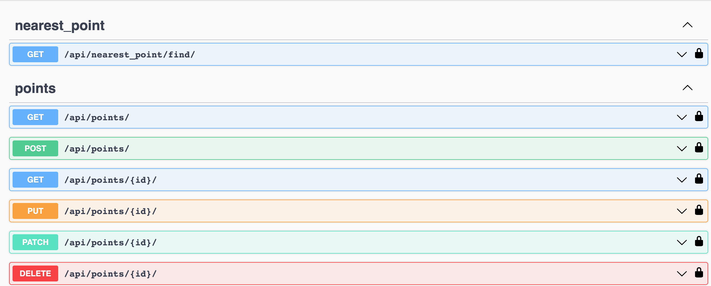
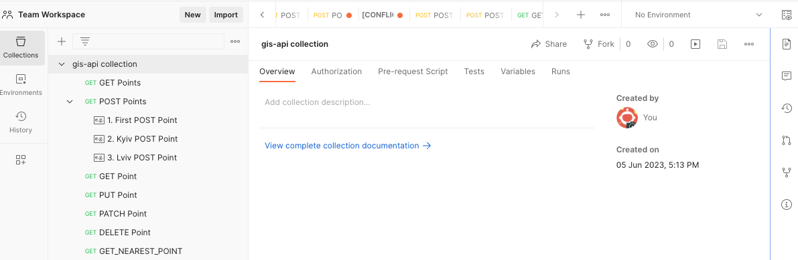

# 🌍 Geospot API 

This project is a Django-based API that allows the creation and retrieval of geographical points (latitude, longitude). It also has the capability to find the nearest point from a given location.


## 🖥️ Technologies 


## 📝 Requirements

To run this project, you'll need:

- Python 3.7+
- Django 4.2.1+
- Django REST Framework
- Django REST Framework GIS
- Django Spectacular
- PostgreSQL with PostGIS

## 🐳 Run with DOCKER
- DOCKER should be installed

```shell
  docker-compose build
  docker-compose up
```

## 🛠 Installation & Set Up

1. Clone the project repository

```bash
git clone https://github.com/Anatolii-Poznyak/gis-api.git
cd geospot
```
2. Create a virtual environment
```bash
python3 -m venv venv
source venv/bin/activate
```
3. Install dependencies
```bash
pip install -r requirements.txt
```
4. Create .env file based on .env.sample file and adjust the settings.
```bash
cp .env.sample .env
```
5. Run migrations and start the Django server
```bash
python manage.py migrate
python manage.py runserver
```
## 🚀 Usage
The API currently provides endpoints:

- `/api/points/` - GET, POST: Create and fetch Points
- `/api/points/<int:id>/` - GET, PUT, PATCH, DELETE: Retrieve, update, or delete a Point
- `/api/nearest_point/find/` - GET: Retrieve the nearest Point to the given coordinates

For example, to find the nearest point to (50.4500336, 30.5241361), send a GET request to /nearest_point/find/?lat=50.4500336&lon=30.5241361.
## 👨‍💻 Project Structure
- admin.py - Custom admin settings for Point Model
- models.py - Django model representing a geographical point
- nearest_point.py - Function to find the nearest point from a given location
- serializers.py - Serializers for Point model and response
- tests.py - Test cases for the models, views, and functions
- urls.py - Routing configurations for the Django API
- views.py - Django views that handle HTTP requests and responses
- settings.py - Django project settings

## 📦 Deployment
You can easily deploy this project on any platform that supports Django and PostgreSQL with PostGIS.

## 📚 Documentation: swagger 🕶
To get detailed information about endpoints, parameters and responses navigate to /api/schema/swagger-ui/ after running the project.

<details>
  <summary>click</summary>
  
  
</details>

## 📮 Postman

If you want to test endpoints via Postman - you can import [this Postman collection](./gis-api%20collection.postman_collection.json)

<details>
  <summary>click</summary>
  
  
</details>